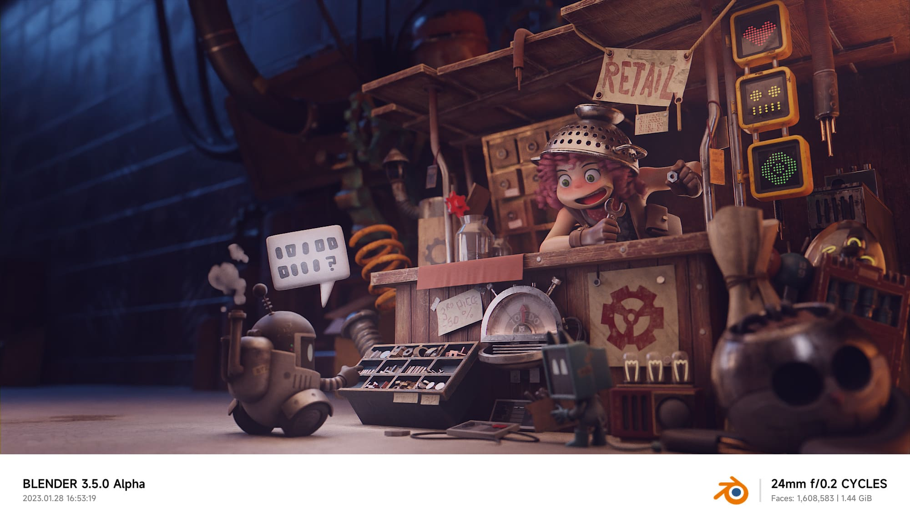

## Shot By Blender 

[English](./README.md) | 中文

> 这个插件提供了一个小米风格的照片水印作用于渲染结果

## 安装
下载最新的zip文件 [此处](https://github.com/atticus-lv/ShotByBlender/archive/refs/heads/master.zip)
通过`编辑`->`首选项`->`插件`->`安装`将其安装到搅拌机中

## 用法
您可以在属性面板-> 输出-> 格式 -> Shot By Blender 找到设置

#### 暗黑模式

#### 全部标签

#### 版本（不勾选）

#### 统计信息&时间

+ 只勾选一个

+ 都不勾选

#### 覆写logo

> 你可以通过选择`覆盖logo`来使用你自己的logo，并在`logo path`中设置你的logo的路径
> 注意:只支持jpg/jpeg/jpg格式

