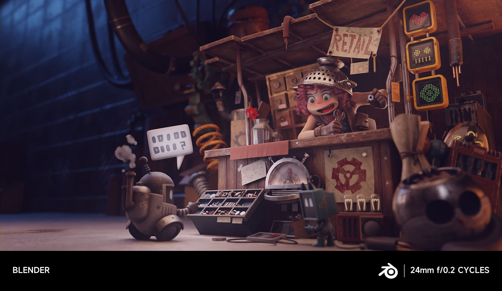
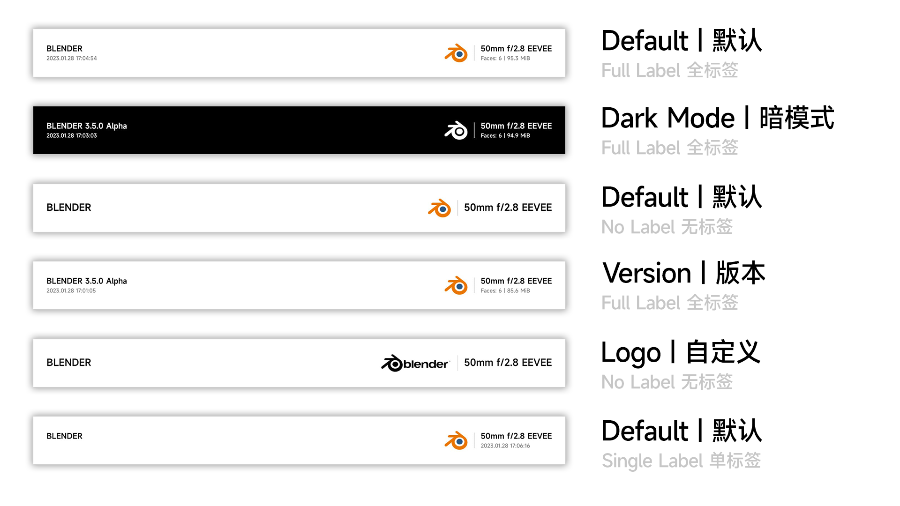

## Shot By Blender 

[English](./README.md) | 中文 | [版本更改](./CHANGE_LOG.md)

> 这个插件提供了一个小米风格的照片水印作用于渲染结果

## 安装
下载最新的zip文件 [此处](https://github.com/atticus-lv/ShotByBlender/archive/refs/heads/master.zip)
通过`编辑`->`首选项`->`插件`->`安装`将其安装到搅拌机中

## 用法
您可以在属性面板-> 输出-> 格式 -> Shot By Blender 找到设置

## 样式

