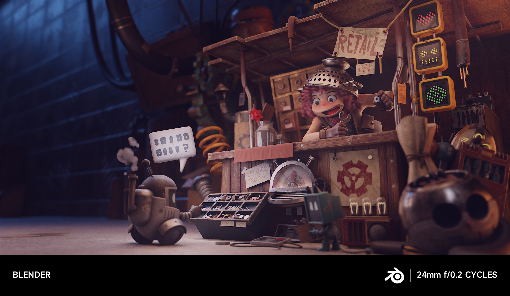
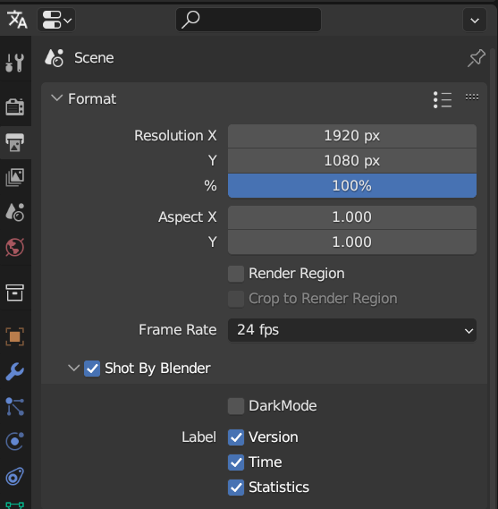
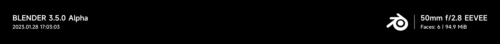
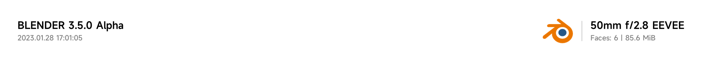
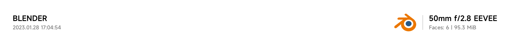
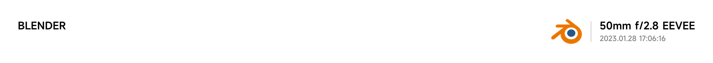
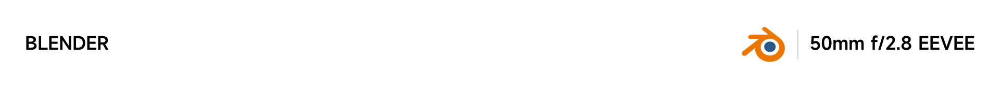
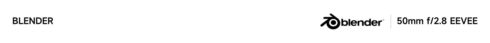

## Shot By Blender 

> This addon provides you a XIAOMI style photo watermark on your render images

## Installation
Download the latest zip file [here](https://github.com/atticus-lv/ShotByBlender/archive/refs/heads/master.zip)
Install it in blender via `Edit` -> `Preferences` -> `Add-ons` -> `Install`

## Usage
You can file the addon in Properties panel -> Output -> Format -> Shot By Blender

#### Dark Mode

#### All Labels

#### Version (Uncheck)

#### Stats&Time 

+ Uncheck One

+ Uncheck Both

#### Overwrite Logo

> You can use your own logo by checking `Overwrite Logo` and set the path of your logo in `Logo Path`
> Notice: Only support jpg/jpeg/png format

