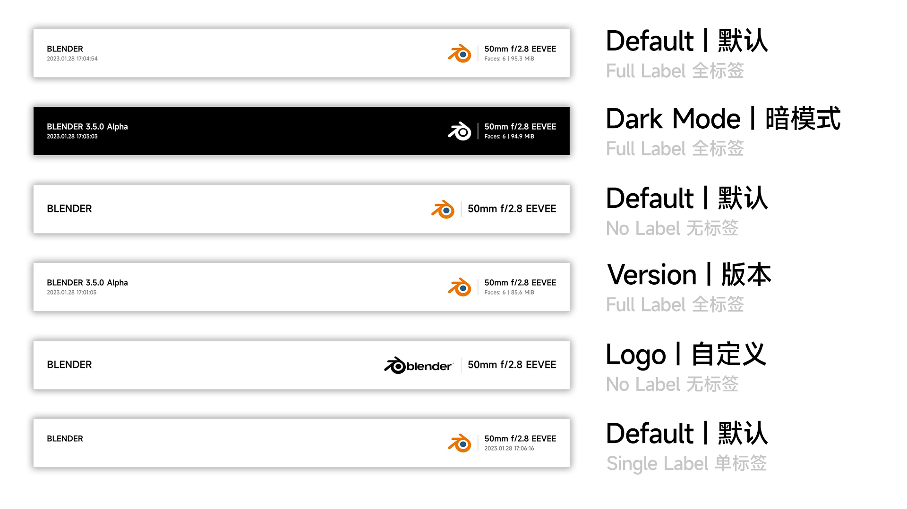

## Shot By Blender 

English | [中文](./README.CN.md)

> This addon provides you a XIAOMI style photo watermark on your render images

## Installation
Download the latest zip file [here](https://github.com/atticus-lv/ShotByBlender/archive/refs/heads/master.zip)
Install it in blender via `Edit` -> `Preferences` -> `Add-ons` -> `Install`

## Usage
You can file the addon in Properties panel -> Output -> Format -> Shot By Blender

## Style

